# app-testing-demo-actions
Azure App TestのGitHub Actionsによるデモ

# 0. 前提事項
- 有効なAzureサブスクリプションを保持していること
- Azure DevOps環境を保持していること
- GitHub 環境を保持していること

# 1. Azure リソースの作成
```
az group create --name <your-resource-group> --location japaneast

az deployment group create `
--resource-group <your-resource-group> `
--template-file deploy/main.bicep `
--parameters envFullName='<your-full-name>'
```

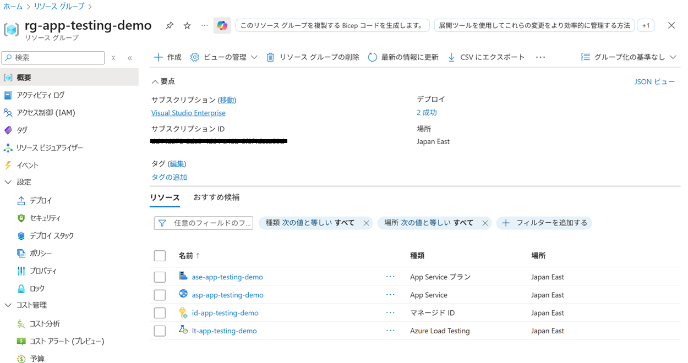

# 2. Load Test の作成
Load test自体は 2025年10月現在 APIが提供されていないため IaC化ができない。そのため手動による構成が必要。

- URLベースのテストを作成する

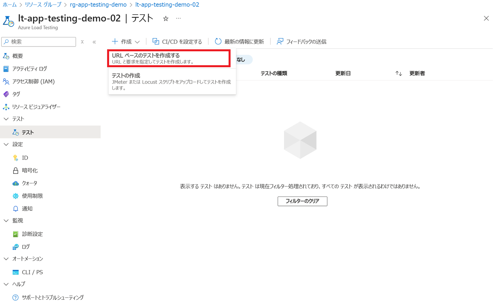

- Basics

|要素|値|備考|
|--|--|--|
|テスト名|load-test-demo-001|任意でOK、ただし半角英数字|
|テストの目的|demo用の簡単なテスト|任意でOK|
|詳細設定を有効にする|OFF|―|
|テストURL|`https://asp-app-testing-demo.azurewebsites.net/`|テストしたいエンドポイント ここではApp Serviceのエンドポイントを指定|
|負荷の指定|仮想ユーザー|―|
|仮想ユーザーの数|50|任意|
|テスト期間(分)|2|デフォルトは20|
|増加時間(分)|1|任意|

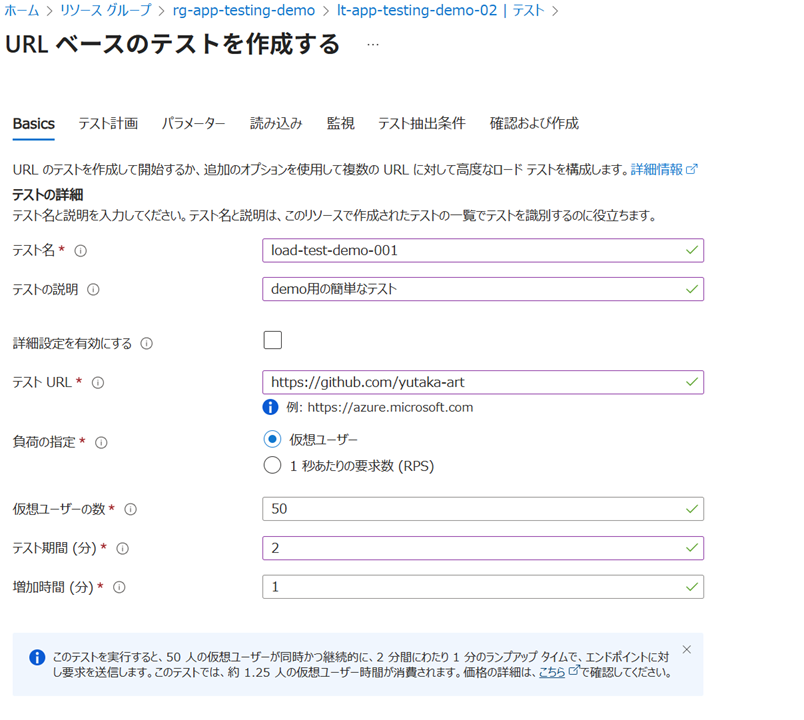

- 確認および作成で、作成をクリック

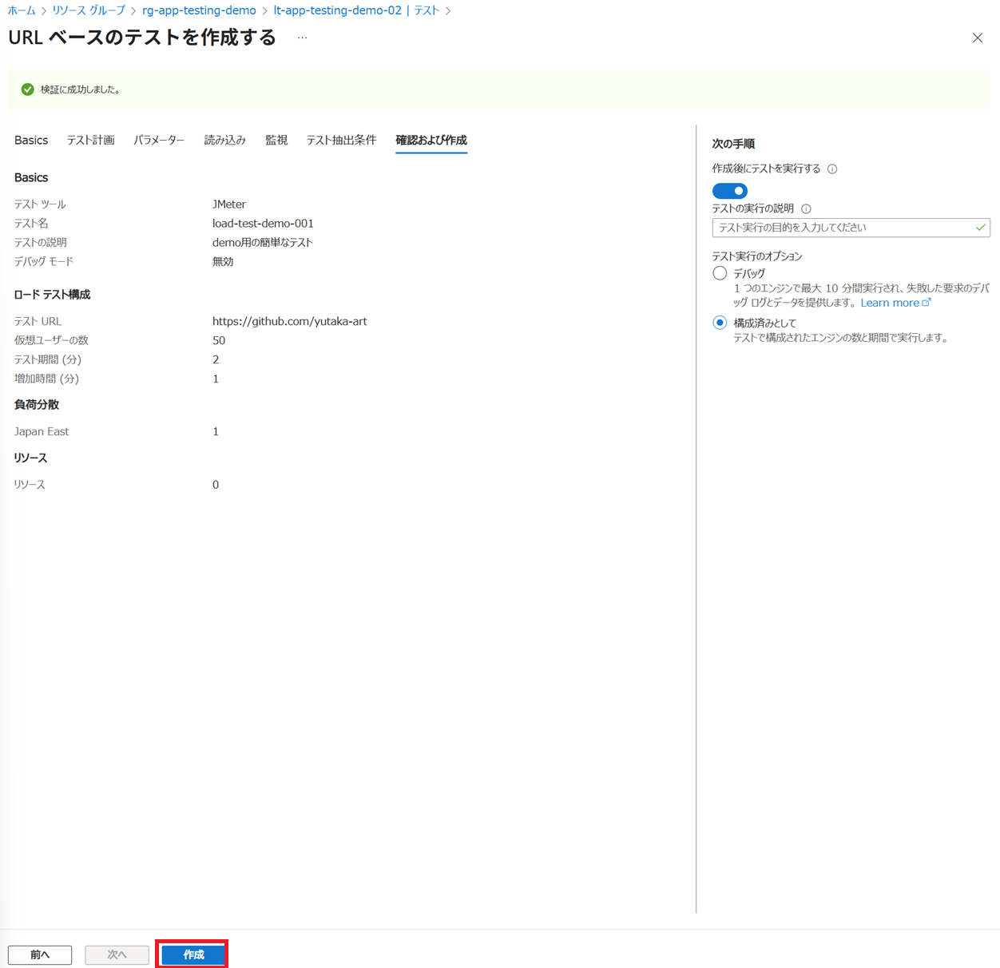

- テストが作成され、自動的に開始される

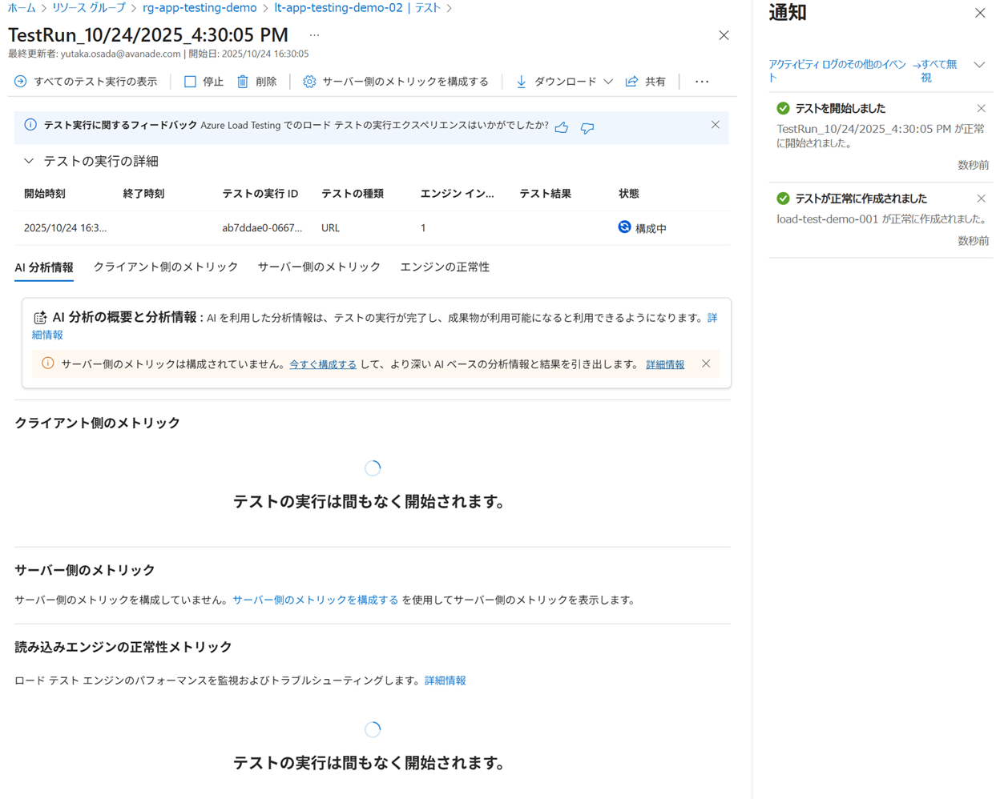

# 3. Azure Pipelines による App Testing 自動化

## 3.1 Azure DevOpsへ拡張機能をインストール
マーケットプレースより、`Azure Load Test` をインストール

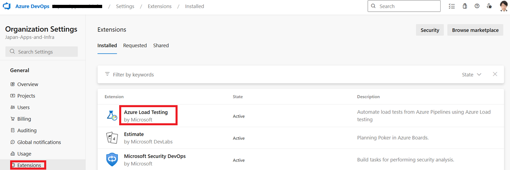

## 3.2 Service Connectionの作成

Create service connection をクリックし、Azure Resource Managerを選択しNext
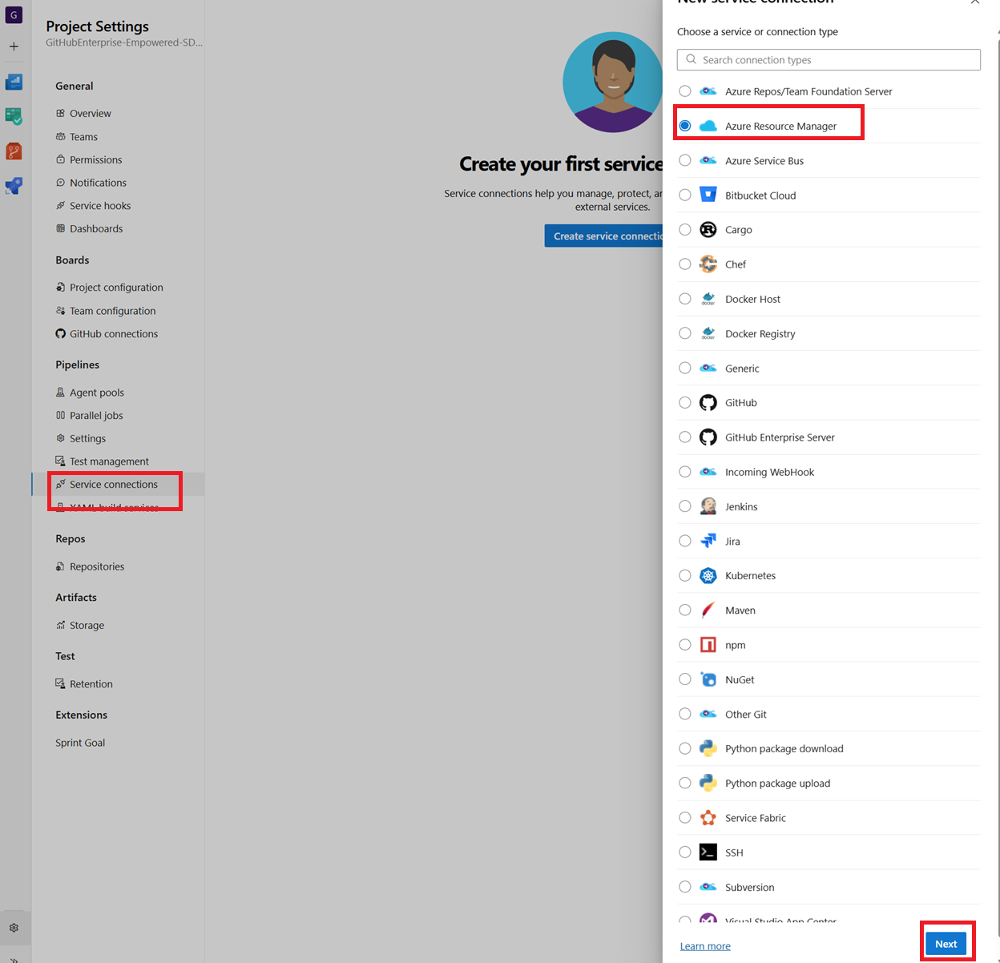

|要素|値|備考|
|--|--|--|
|Identity type|Managed Identity|―|
|Subscription for managed identity.|<your-subscription-id>|―|
|Resource group for managed identity.|<your-resource-group>|`#1で作成したリソースグループ`|
|Managed Identity|<your-managedid>|`#1で作成したマネージドID`|
|Scope level for service connection.|
Subscription|―|
|Subscription for service connection.|<your-subscription-id>|―|
|Service Connection Name|sp-app-testing-demo|任意の名称を指定|
|Security|ON|―|

## 3.3 Azure Repos を作成
任意の Projectへ、Azure Reposを作成する

GitHub リポジトリからAzDOフォルダをAzure DevOpsへ移してPushする

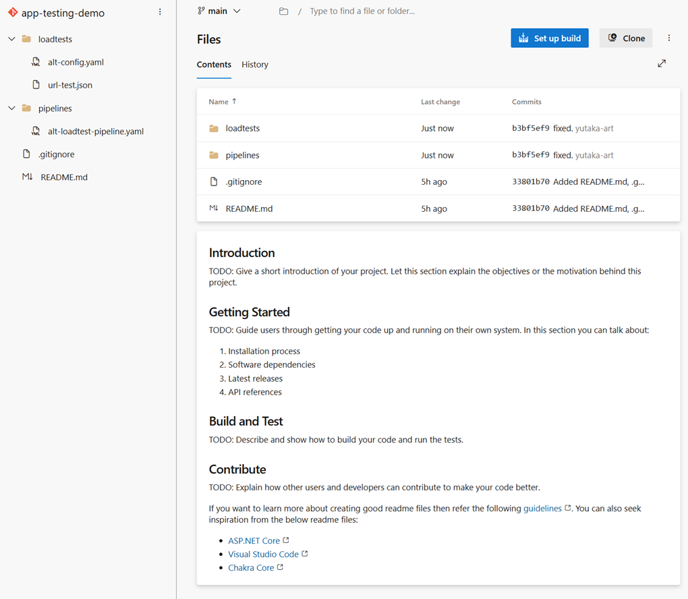

> [!IMPORTANT]
> testId を Load Test のIDに変更すること

## 3.4 Azure Pipelines を作成

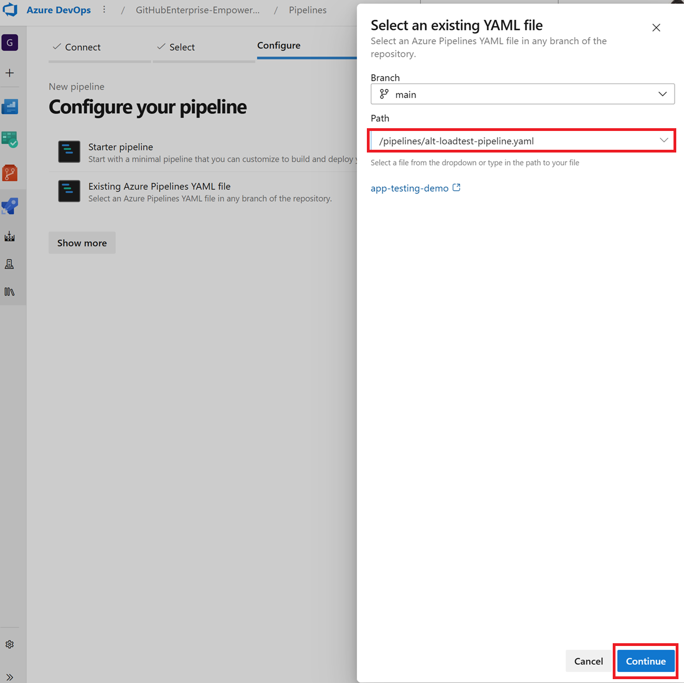

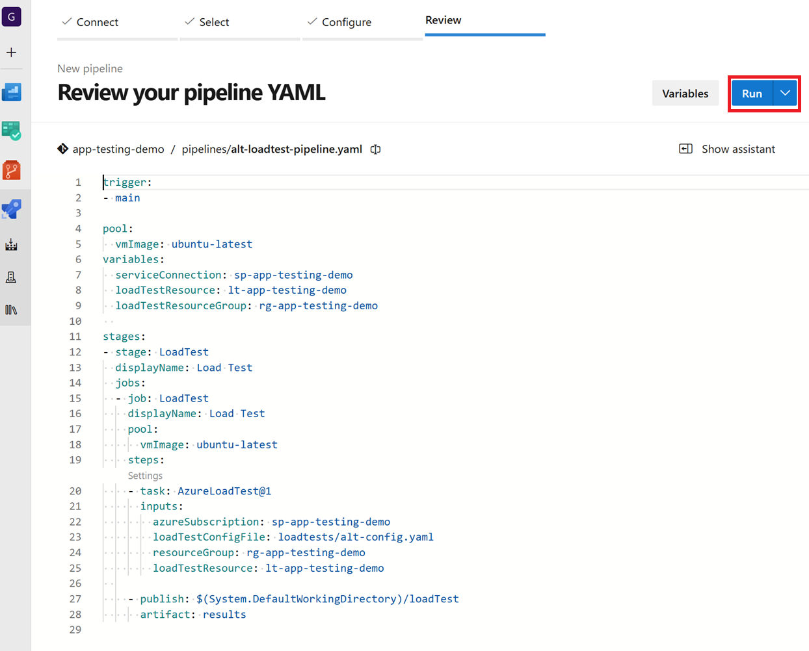

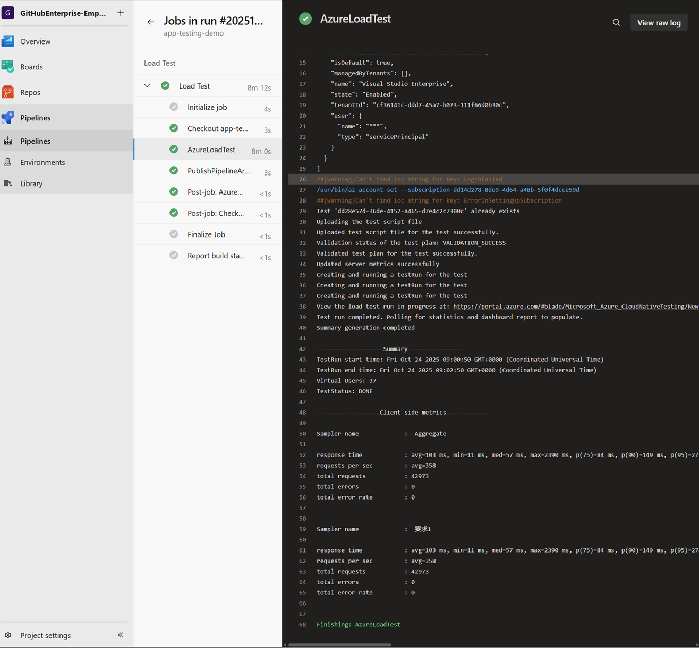

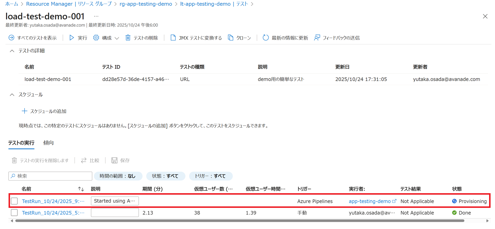

# 4. GitHub Actions による App Testing 自動化

## 4.1 マネージドIDのOIDC構成
GitHub ActionsからAzureコンポーネントを操作するために、マネージドID、OIDCを構成する
マネージドIDへフェデレーション資格情報を登録する

- Azureの情報取得
Azure Portalより、以下の情報を取得する。

|情報|取得先|
|--|--|
|サブスクリプションID|`Azure Portal > サブスクリプション`|
|テナントID|`Azure Portal > Entra ID`|
|クライアントID|`Azure Portal > リソースグループ > マネージドID`|

- サブスクリプションID


- テナントID


- クライアントID


- GitHub Repository Secretへ登録
取得した情報を、GitHub Repository Secret として登録する。

- `Repository > Settings > Secrets and variables > Actions` をクリックし、`New repository secret` ボタンをクリックし、それぞれ登録をする

|シークレット名|値|
|--|--|
|AZURE_SUBSCRIPTION_ID|サブスクリプションID|
|AZURE_TENANT_ID|テナントID|
|AZURE_CLIENT_ID|クライアントID|


- `Azure Portal > リソースグループ > マネージドID フェデレーション資格情報> `をクリックし、上で登録した資格情報で構成する


- 入力に必要な情報は以下の通り

|要素|値|備考|
|--|--|--|
|発行者|`https://token.actions.githubusercontent.com`|編集しなくてOK|
|組織|―|リポジトリの所属するGitHubの組織|
|リポジトリ|―|GitHubリポジトリ名|
|エンティティ|ブランチ|―|
|ブランチ|main|―|
|サブジェクト識別子|―|変更しなくてOK|
|名前|oidc-app-testing|任意の名前でOK|
|対象ユーザー|api://AzureADTokenExchange|編集しなくてOK|


## 4.2 GitHub Repository を作成
任意の Organizationへ、Repositoryを作成する

GitHub リポジトリから作成したリポジトリへ移してPushする

> [!IMPORTANT]
> testId を Load Test のIDに変更すること

## 4.3 GitHub Actions の作成
GitHub Actionsは特に手順はなくそのまま起動できるため動作確認をおこなう

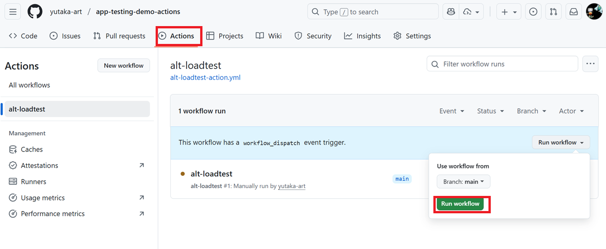
